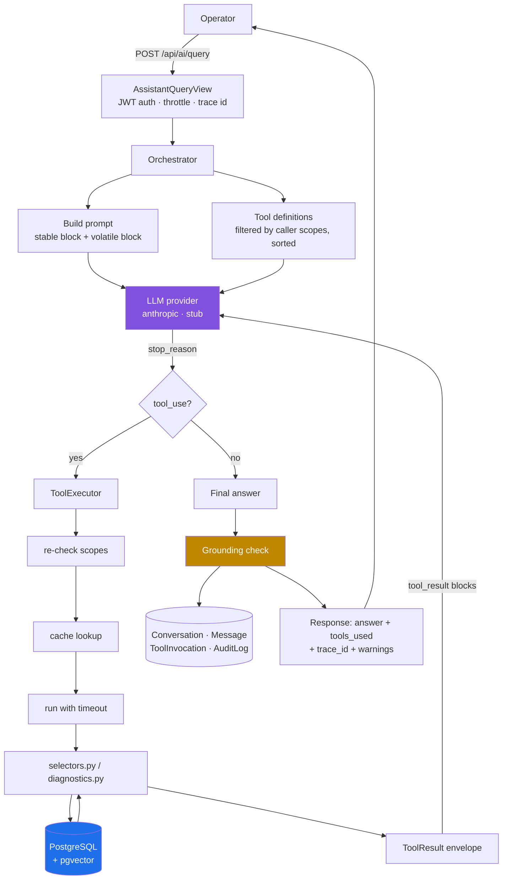
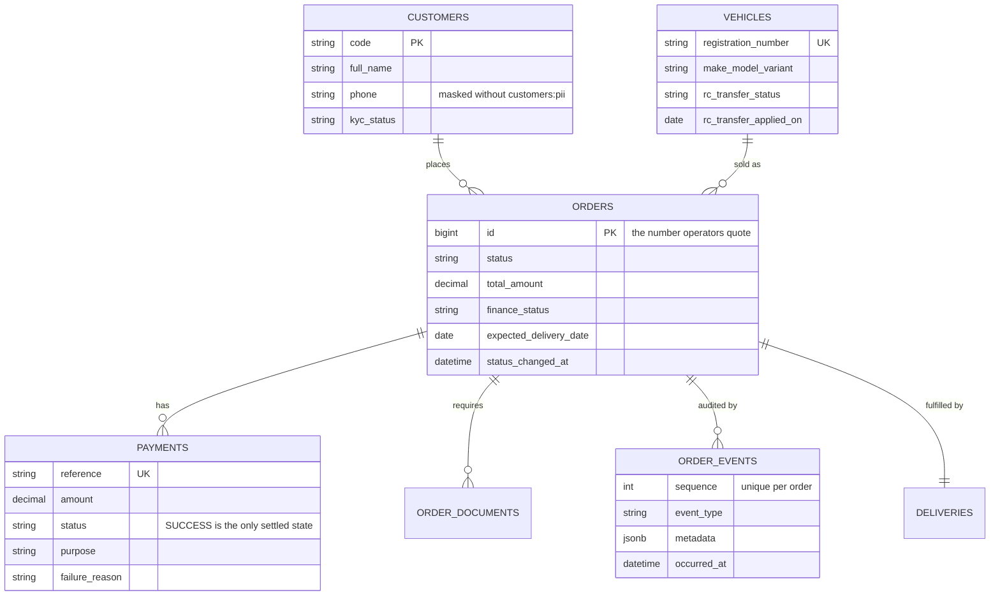
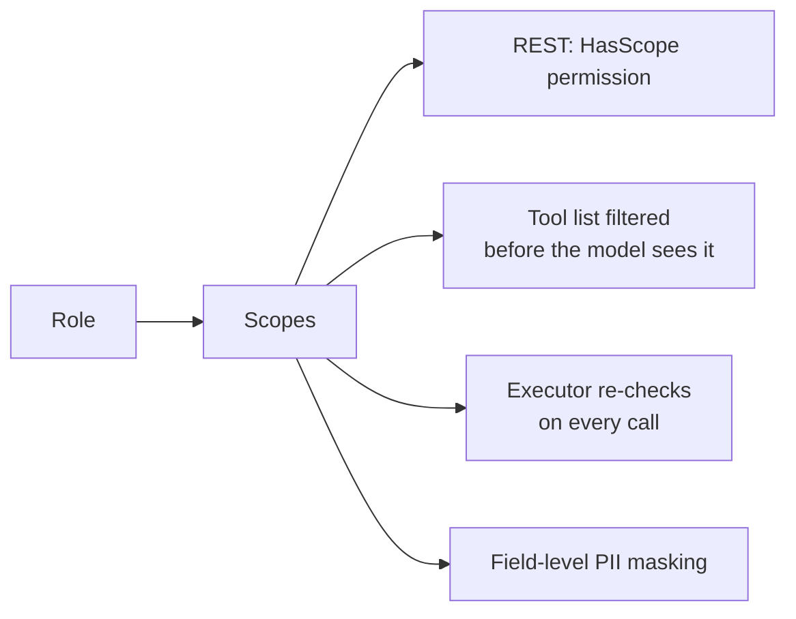
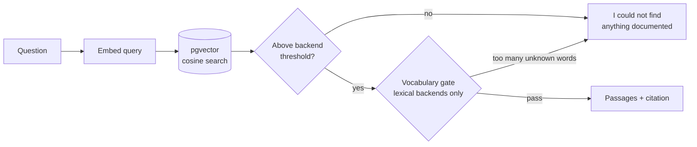
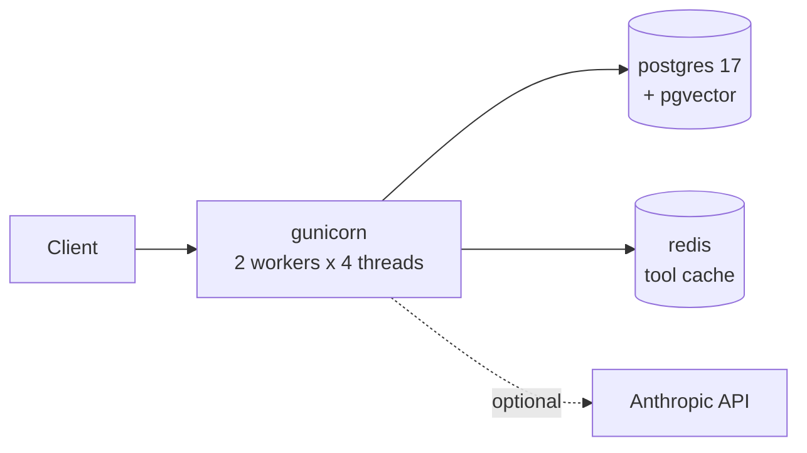

# Architecture

How a natural-language question becomes a grounded answer, and where the
guarantees live.

---

## 1. The core constraint

> The LLM understands the question and writes the prose. It never supplies a
> fact.

Everything below follows from that. The model's job is intent extraction, tool
selection, and narration. Every number, date, name and status in an answer
originates from a PostgreSQL row.

---

## 2. Request flow



The loop runs at most `LLM_MAX_TOOL_ITERATIONS` (default 6) times. Parallel
`tool_use` blocks in one assistant turn execute concurrently and return as a
single user message — splitting them across messages teaches the model to stop
batching.

---

## 3. Layers

| Layer | Module | Responsibility |
|---|---|---|
| HTTP | `apps/assistant/views.py` | Auth, throttling, request/response shape |
| Orchestration | `apps/assistant/orchestrator.py` | The tool-calling loop, budgets, grounding, persistence |
| Prompt | `apps/assistant/prompts.py` | System prompt split for cache stability |
| Model | `apps/assistant/llm/` | Provider contract + Anthropic and stub drivers |
| Tools | `apps/assistant/tools/` | Registry, scope filtering, execution, caching |
| **Read layer** | `apps/operations/selectors.py` | **The single source of operational truth** |
| Rules | `apps/operations/diagnostics.py` | Deterministic blocker analysis |
| Retrieval | `apps/knowledge/` | Chunking, embeddings, pgvector search, refusal guards |
| Domain | `apps/operations/models.py` | Tables |

The important edge is **Tools → selectors**. The REST API calls the same
functions. There is no query path available to the assistant that is not also
available to a human with the same role.

---

## 4. Data model



Design notes:

- **`orders.id` is the business identifier.** Operators say "order #1243", so
  the primary key is exposed rather than hidden behind a surrogate reference.
- **`deliveries` and `order_documents` go beyond the five entities in the
  brief.** They carry most of the blocker signal — you cannot explain a stuck
  order without knowing which document was rejected or how many delivery
  attempts failed.
- **`order_events` is append-only** with a per-order `sequence` unique
  constraint, so a timeline cannot develop duplicate or reordered steps.
- **Money is `Decimal`**, never float. It reaches the model pre-formatted.

### Seed integrity

The seeder derives every `order_events` row *from* the payment, document,
finance and delivery rows it just created. A PAN rejected on day 9 always has a
matching `DOCUMENT_REJECTED` event on day 9. This makes it impossible for the
timeline to contradict the ledger — which matters because the assistant reads
both, and contradictory seed data produces confidently wrong answers that look
like model failures.

---

## 5. Grounding: four mechanisms

A prompt instruction alone ("do not make things up") is not an architecture.

| # | Mechanism | Failure it prevents |
|---|---|---|
| 1 | Tools are the only data path, sharing selectors with the REST API | A private query path with different authorization |
| 2 | Money/dates pre-formatted as `{"value", "display"}` | Model arithmetic and mangled lakh/crore grouping |
| 3 | Citations built from **execution records**, not the model's narration | "I checked the ledger" when it never called the tool |
| 4 | Grounding check flags rupee amounts when no tool succeeded | Fabricated figures passing silently |

Mechanism 4 deliberately **warns rather than rewrites**. Silently editing model
output hides the failure; the warning surfaces in the response body, the logs
and the audit row where someone can act on it.

---

## 6. Authorization

One scope vocabulary gates both the REST API and the tools.



**Withholding beats refusing.** A viewer's model is never shown
`diagnose_order_blockers`, so there is nothing to jailbreak it into calling.
The executor re-checks anyway — defence in depth is only depth if the second
layer actually works.

PII masking is decided by the caller's scopes, not the request, and the masked
payload says *why*:

```json
{"phone": "******9056", "pii_visible": false,
 "pii_note": "Contact details are masked because the requesting role lacks
              the 'customers:pii' scope. Do not guess the hidden digits."}
```

That lets the assistant explain the restriction instead of pretending the data
does not exist.

---

## 7. Why blocker analysis is not the model's job

Give a model raw order rows and ask "why is this stuck?" and it returns a
fluent, plausible story that is sometimes wrong. An operator will act on it.

`diagnostics.py` runs ~15 rules. Each finding carries a severity, named
**evidence**, an **owning team** and a **suggested action**. The model narrates
them; it does not derive them. Same order in, same findings out — reproducible
and reviewable.

Two properties that emerged from testing against seeded data:

**Causes outrank symptoms.** Order #2325 is 6 days overdue for delivery, but
that is a *consequence* of a rejected PAN. Sorting by severity alone put the
symptom first, which would send an operator to Logistics when the fix sits with
Documentation. Findings sort by `(severity, cause_rank)`, and symptoms are
reported separately as "knock-on effects".

**Not crying wolf is the harder half.** An early version flagged every new
order, because "mandatory documents not uploaded" was unconditionally `high` —
but that is the normal state of a one-day-old order. Age-grading against a
collection SLA took flagged orders from 66% to 52%, with every remaining flag
traceable to a deliberately broken seed scenario. Roughly half the diagnostics
tests assert an order is **not** stuck.

---

## 8. Retrieval (RAG)



Two independent guards, calibrated empirically by
`manage.py calibrate_knowledge` (recall **19/19**, off-topic leakage **0/11**):

1. **A per-backend relevance floor.** Cosine scores are only comparable inside
   one embedding space, so the threshold is a property of the backend
   (`hashing: 0.17`, `voyage: 0.50`), not of the application.
2. **A vocabulary gate.** Cosine alone cannot reject *"what is our policy on
   flying drones over the hub?"* — it genuinely shares vocabulary ("policy",
   "hub") with a real policy. If too many topical words appear nowhere in the
   corpus, the topic is undocumented. Applied only to lexical backends; a
   semantic model is *supposed* to match paraphrases.

**Embedding signatures.** Every stored chunk records its embedder signature
(`hashing:v2`). Editing the stopword list once changed how queries were
embedded while 47 stored vectors kept the old geometry — no error, just quietly
degraded scores. Retrieval now filters on the signature, so stale vectors
become invisible and you get *"run ingest_knowledge"* instead of bad matches.

---

## 9. Conversation context

Stored per conversation: the last N turns (question + prose answer) and a
`context` JSONB holding the last resolved order id.

**Tool results are deliberately not replayed.** A follow-up like *"and what
about its payment?"* resolves the order id from context, then **re-reads the
database**. Serving an answer from a payment status fetched four turns ago is a
correctness bug, not a context optimisation.

---

## 10. Prompt caching

Anthropic caching is a prefix match over `tools → system → messages`. The
design accounts for this:

```
tools     : sorted by name, stable across requests
system[0] : large, byte-identical rule block  ← cache_control breakpoint
system[1] : volatile — role, scopes, date, conversation context
messages  : history + current question
```

A timestamp in `system[0]` or a non-deterministic tool order would silently
destroy the hit rate — no error, just a larger bill. Tests assert both
properties.

---

## 11. Reliability

| Concern | Handling |
|---|---|
| Slow tool | Per-tool wall clock (`TOOL_TIMEOUT_SECONDS`); returns a `TIMEOUT` envelope, never hangs the request |
| Model 429 / 5xx | SDK retries with exponential backoff (`LLM_MAX_RETRIES`) |
| Model refusal | `stop_reason: refusal` handled explicitly; server-side fallback opt-in |
| Runaway loop | Hard iteration ceiling, then answer from what was gathered |
| Cache outage | `IGNORE_EXCEPTIONS` — degrades to uncached reads |
| Tool exception | Caught at the boundary, returned as `ok: false`; never raises into the model |
| Observability | Trace id in logs, audit rows, `X-Trace-Id`; per-tool latency and cache-hit recorded |

**Known gap:** a timed-out tool keeps running until Postgres gives up — Python
cannot safely kill a thread. The user is not made to wait, but real protection
belongs in `statement_timeout` on the database role.

---

## 12. Deployment



Threads matter: tool execution is I/O-bound (Postgres and the model API), so
threads buy real concurrency without the memory cost of more processes. The
180s gunicorn timeout is generous because a multi-tool turn on a real model
legitimately takes tens of seconds.

The stack runs fully offline — `LLM_PROVIDER=stub` and
`EMBEDDING_PROVIDER=hashing` need no credentials and cost nothing, which is
what makes the test suite hermetic and the demo reproducible.

**Not production-ready as-is:** migrations run in the container entrypoint,
which is fine for a demo but wrong for multi-replica deploys where concurrent
`migrate` calls can deadlock. They belong in a release step that runs once.
